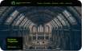

# Semester-Project: Community Science Museum.


This site is a submission which was to be graded as the last task for the first semester. Task provided images, opening hours, exhibits, and generally most of the content. This was out first graded assignment, so the quality is significantly lower. We had not yet started learning any javascript. 

## Description
- I was tasked with creating a website for a new science museum coming to my city, where the target audience was supposed to be families with teenagers or younger kids.
- The purpose of the museum is to educate people on pretty advanced science in a fun way to make it easy to learn. 
- The design is meant to remind one of science, with a green and black colour mix, and a pretty scientific-looking font. 

## Built With
HTML and CSS.

## Getting Started
### Installing
In order to take a look at this project, the netlify deployment link is: https://comforting-narwhal-ba7200.netlify.app/
To view the code, you must clone this repository

1. Clone the repo:
```bash
git clone git@github.com:NoroffFEU/portfolio-1-example.git
```
2. Install the dependencies:
```bash
npm install
```
personally i would use (terminal):
```bash
git pull
```
### Running
To run the code, use one of these commands: 
```bash
npm run start
```
personally i would use (terminal): 
```bash
code .
```

## Contributing
I do not allow anyone to directly contribute to this repository, but anyone can make their own version with parts of- or the entirity of my code as long as it is stated somewhere visible that the original creator is ERIKHHJ on github. 

## Contact
I can be contacted on: 
1. Instagram: erikhjulstad
2. Email: erikhhju@gmail.com
3. I do not (yet) have a LinkedIn page. 


## Acknowledgments
For this particular assignment, I did not recieve much input while working, except for feedback given to me by my mother when casually showing what I was working on. So thanks mom!